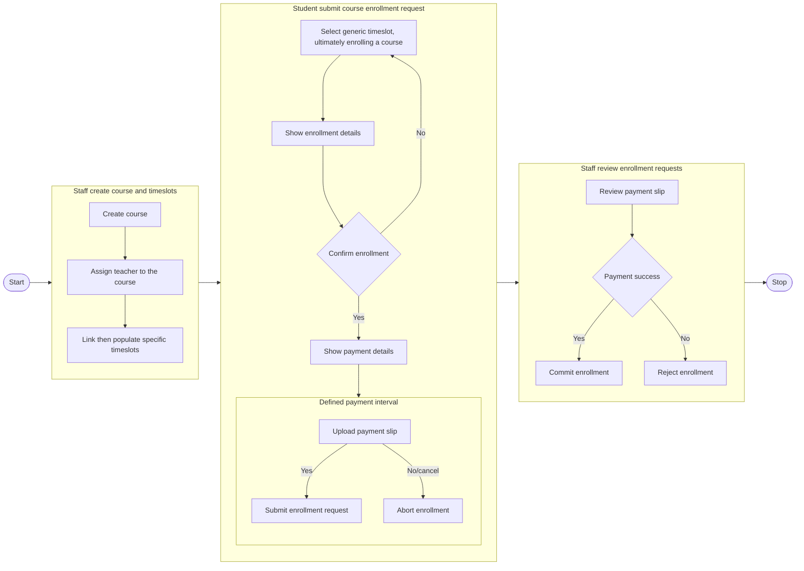

# Business Logic

All the logic

## Course Creation and Enrollment

```mermaid
flowchart LR

    subgraph staffCreateCourse[Staff create course and timeslots]
        direction TB

        courseCreate[Create course] --> courseTeacherAssign[Assign teacher to the course] --> timeslotSpecificCreate[Link then populate specific timeslots]
    end

    subgraph studentEnrollCourse[Student submit course enrollment request]
        direction TB

        timeslotGenericSelect[Select generic timeslot, ultimately enrolling a course]

        timeslotGenericSelect ---> enrollmentDetails[Show enrollment details]

        enrollmentDetails ---> confirmEnrollment{Confirm enrollment}
        confirmEnrollment -- No --> timeslotGenericSelect
        confirmEnrollment -- Yes --> paymentDetails

        paymentDetails[Show payment details]

        subgraph uploadPaymentSlipInterval[Defined payment interval]
            direction TB

            uploadPaymentSlip[Upload payment slip]
            uploadPaymentSlip -- Yes --> submitEnrollmentRequest[Submit enrollment request]
            uploadPaymentSlip -- No/cancel --> abortEnrollment[Abort enrollment]
        end

        paymentDetails --> uploadPaymentSlipInterval{Upload payment slip}
    end

    subgraph staffConfirmEnrollment[Staff review enrollment requests]
        direction TB
    
        reviewPaymentSlip[Review payment slip] --> confirmPaymentSlip{Payment success}
        confirmPaymentSlip -- Yes --> enrollSuccess[Commit enrollment]
        confirmPaymentSlip -- No --> enrollFailure[Reject enrollment]
    end

    start([Start]) --> staffCreateCourse
    staffCreateCourse --> studentEnrollCourse
    studentEnrollCourse --> staffConfirmEnrollment
    
    staffConfirmEnrollment --> stop([Stop])
```

- Defined payment interval: short 5min?
