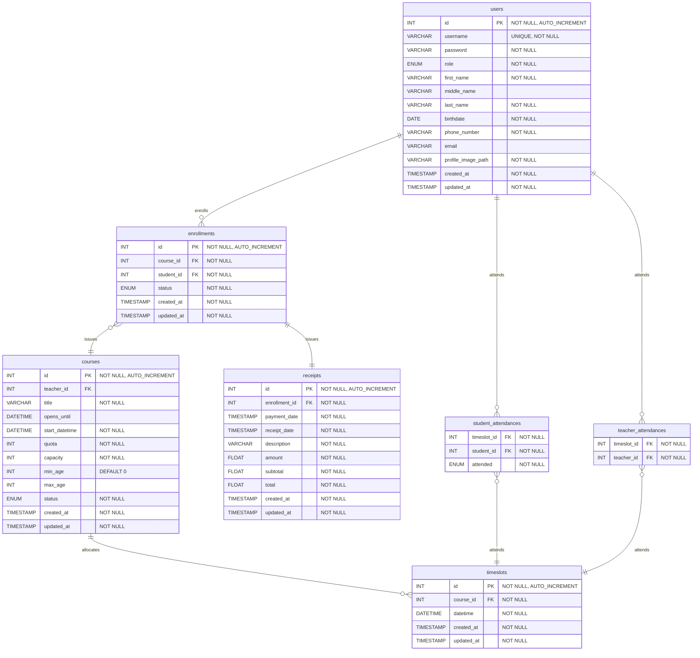

# ER Diagram

> **View online here**: [mermaidchart.com](https://www.mermaidchart.com/raw/930a80f8-a45b-40eb-9f5e-878a44120805?version=v0.1&theme=light&format=svg)

## Notes

- Teachers list course members by

        SELECT * FROM `enrollments` WHERE `course_id` = '<COURSE_ID>' AND `status` = 'SUCCESS';

- Teachers list timeslot members for attendance checking by

        SELECT * FROM `student_attendances` WHERE `timeslot_id` = '<TIMESLOT_ID>';

    To check a student's attendance

        UPDATE `student_attendances` SET `attended` = 'TRUE' WHERE `student_id` = '<STUDENT_ID>';
