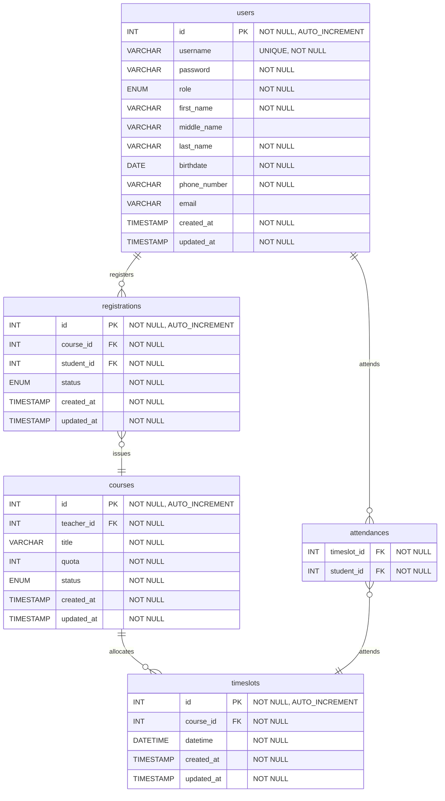

# ER Diagram

```mermaid
erDiagram
    users {
        INT id PK "NOT NULL, AUTO_INCREMENT"
        VARCHAR username "UNIQUE, NOT NULL"
        VARCHAR password "NOT NULL"
        ENUM role "NOT NULL"
        VARCHAR first_name "NOT NULL"
        VARCHAR middle_name
        VARCHAR last_name "NOT NULL"
        DATE birthdate "NOT NULL"
        VARCHAR phone_number "NOT NULL"
        VARCHAR email
        TIMESTAMP created_at "NOT NULL"
        TIMESTAMP updated_at "NOT NULL"
    }

    courses {
        INT id PK "NOT NULL, AUTO_INCREMENT"
        INT teacher_id FK "NOT NULL"
        VARCHAR title "NOT NULL"
        INT quota "NOT NULL"
        ENUM status "NOT NULL"
        TIMESTAMP created_at "NOT NULL"
        TIMESTAMP updated_at "NOT NULL"
    }

    registrations {
        INT id PK "NOT NULL, AUTO_INCREMENT"
        INT course_id FK "NOT NULL"
        INT student_id FK "NOT NULL"
        ENUM status "NOT NULL"
        TIMESTAMP created_at "NOT NULL"
        TIMESTAMP updated_at "NOT NULL"
    }

    timeslots {
        INT id PK "NOT NULL, AUTO_INCREMENT"
        INT course_id FK "NOT NULL"
        DATETIME datetime "NOT NULL"
        TIMESTAMP created_at "NOT NULL"
        TIMESTAMP updated_at "NOT NULL"
    }

    attendances {
        INT timeslot_id FK "NOT NULL"
        INT student_id FK "NOT NULL"
    }

    users ||--o{ registrations : registers
    registrations }o--|| courses : issues

    courses ||--o{ timeslots : allocates
    users ||--o{ attendances  : attends
    attendances }o--|| timeslots : attends
```
