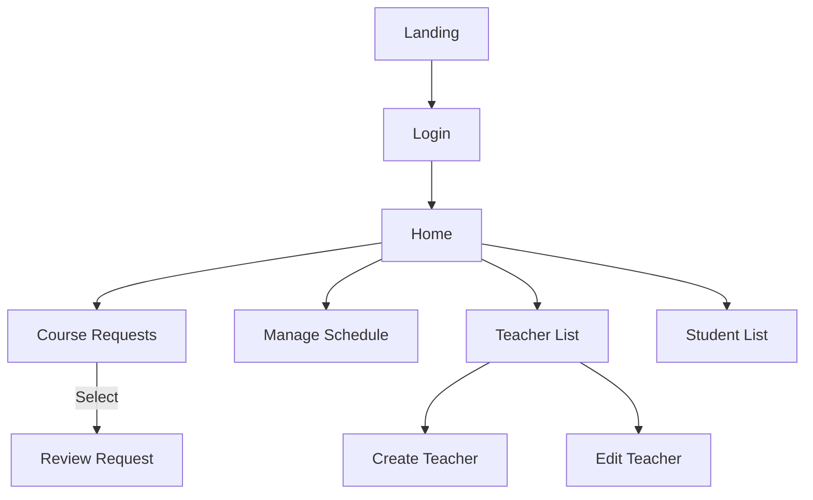
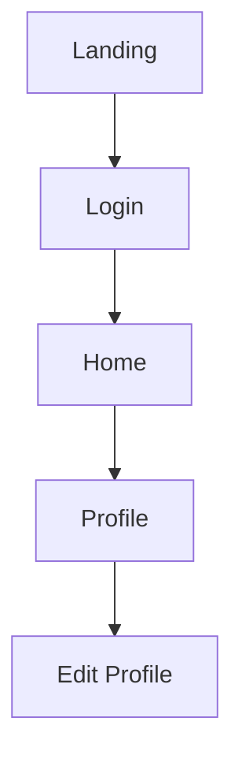
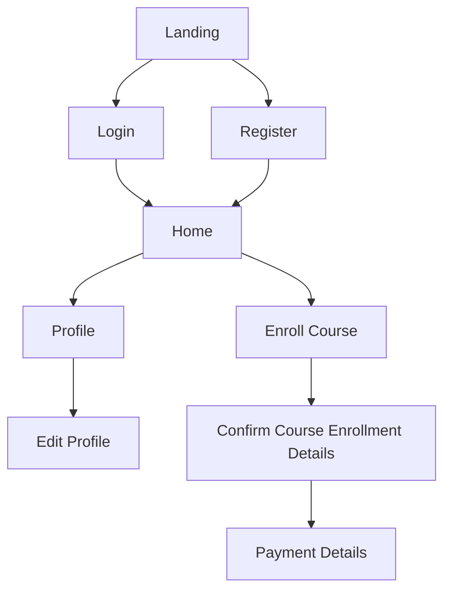

# Page Flow

> **View online here**: [mermaidchart.com](https://www.mermaidchart.com/raw/7d0eb959-dbbf-4d38-822f-5882321e7f74?version=v0.1&theme=light&format=svg)  

All the pages

## Staff

- Home
    - Index schedule
- Home > Manage Schedule
    - Edit schedule pane
    - Create schedule pane

## Teacher

- Home
    - Index schedule
        - Calendar pane
        - Agenda pane
            - Student attendance pop-up

        

## Student

- Home
    - No classes
    - Enroll status -- progress bar
    - Course progress -- time table
- Home > Profile
    - Personal info pane
    - History & Certificates pane
- Home > Enroll Course
    - Course constraint filters -- full/half
    - Generic timeslots
- Home > Payment Details
    - Show payment details
    - Submit payment slip
