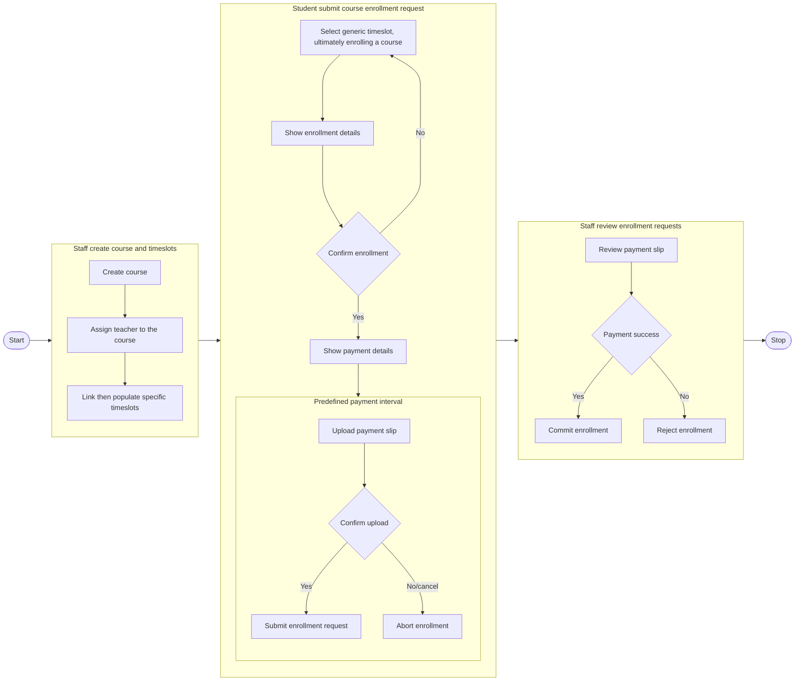

# Business Logic

All the logic

## Terms

1. *generic timeslot*  
    A timeslot that includes day of week and time, e.g., `Tue 08:00:00`.
1. *specific timeslot*  
    A timeslot that includes date and time, e.g., `2023-10-31 08:00:00`.

## Course Creation and Enrollment

> **View online here**: [mermaidchart.com](https://www.mermaidchart.com/raw/7d0eb959-dbbf-4d38-822f-5882321e7f74?version=v0.1&theme=light&format=svg)  

- Predefined payment interval: short 5min?
